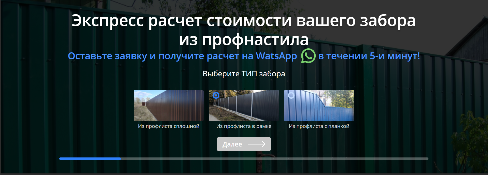
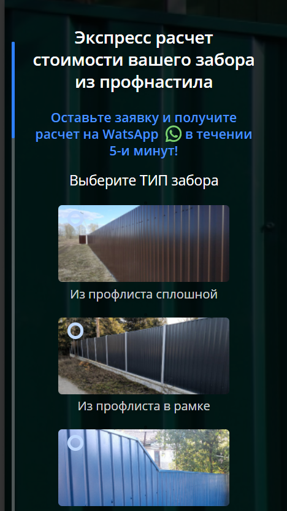

# Kwiz
Квиз по расчету стоимости забора

Пошаговая форма, расчета стоимости забора. Функциональная часть реализована на нативном JavaScripit. Отправка на почту Jquery+ajax+php
Из особеностей: 
1. Для добавления или удаления шага нужно добавить/удалить контейнер .quiz__step
2. Ползунок показывающий на каком этапе находится форма формируется автоматически, в зависимости от того сколько шагов имеется.  
3. Полузнок, так же является переключателем шагов. 
4. Графические радио кнопки, являются переключателями шагов. Для того, что бы при выборе графических радио кнопок не происходило переключение шагов, надо удалить класс .label-radio из соотвествующего label
5. Кнопки переключения включаются/отключаются автоматически на первом и последнем слайде. 

 
 
